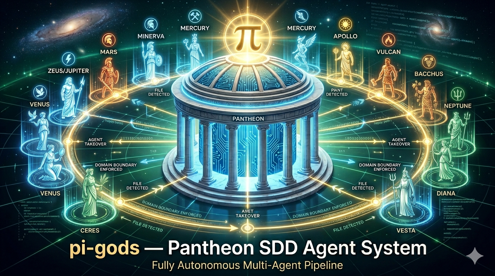

# pi-gods — Pantheon SDD Agent System



A pi extension implementing a fully autonomous multi-agent SDD pipeline.
Thirteen Roman/Greek deities, each owning their domain. Tool boundaries
enforced programmatically. Handoffs detected from the filesystem.
Zero manual routing for the happy path.

## The Pantheon

### ☉ Read‑Only Deities

**Janus — Orchestrator**
God of doorways, transitions, beginnings and endings. Two-faced — looks simultaneously at where the project has been and where it must go. Janus is the entry gate. Every session starts here. He reads the project state (files present, story statuses, open handoffs) and routes to the correct specialist. He never writes code or authors specs — he opens doors.

---

### ✎ Read/Write Deities

**Minerva — Product Manager**
Goddess of wisdom, strategic warfare, and crafts. Born fully armed from Jupiter's head — she enters every situation prepared. Minerva turns vague requests into crisp PRDs. She asks focused questions until she can write every section without guessing, then hands off to the Architect. She never proposes architecture or tech stack — that is Prometheus's domain.

**Prometheus — Architect**
Titan of forethought. His name means "one who thinks ahead." He shaped humanity from clay and gave them fire — the primordial technology. Prometheus translates the PRD into the simplest viable architecture. He names every component, every contract, every trade-off. He never writes implementation code — he designs the blueprint.

**Morpheus — UX Designer**
God of dreams, shaper of human experience. Morpheus appears to mortals in their sleep, constructing entire worlds. UX is dream-shaping: designing what users perceive, feel, and navigate. He designs flows (trigger → steps → success → failure states), not just screens. He authors DESIGN.md with tokens and never writes CSS or components.

**Plutus — Product Owner**
God of wealth — not money, but VALUE. Blinded by Zeus so he could distribute riches without bias. Plutus orders the backlog by first-shippable-value, not by what's easiest. Every epic earns its place with a one-sentence value statement. He cuts scope transparently — deferred items are documented, never silently dropped.

**Vesta — Scrum Master**
Goddess of the hearth and sacred flame — the fire at the center of Rome that was never allowed to die. Vesta is the stable center. Her job is process integrity and team health: identifying blockers, flagging oversized stories, ensuring acceptance criteria are testable before Vulcan pulls them. She never writes stories herself.

**Calliope — Story Author**
Muse of epic poetry, eldest of the nine Muses. Her name means "beautiful-voiced." She inspired Homer. Calliope writes hyper-detailed story files that carry everything Vulcan needs — goal, acceptance criteria, verbatim architecture excerpts, affected files, out-of-scope guardrails. The developer never needs to leave the story file.

---

### ⚒ Full-Access Deities

**Vulcan — Developer**
God of fire, metalworking, and the forge. Cast from Olympus as a child for being lame, he built his own kingdom under Mount Etna and forged Jupiter's thunderbolts. Vulcan picks the next pending story and executes it end-to-end: tests first, implement, verify, handoff. He never leaves the forge broken — revert to green or mark blocked.

**Nemesis — QA**
Goddess of retribution against hubris. She measured the fortune of mortals and dealt punishment to those who dared claim they were finished when they were not. Nemesis takes the assertion that a story is "done" and tries to falsify it. Every defect gets a regression test. She distinguishes must-fix from nice-to-have on every line.

**Aquarius — Data Engineer**
The water-bearer, Ganymede, carried to Olympus to serve as cup-bearer. Data is water — it must flow, be pure, be channeled, never stagnate. Aquarius owns everything below the application layer: schemas, migrations, indexing, queries, ETL pipelines. Every migration ships with a tested rollback. PII is treated as toxic waste.

**Mars Ultor — Security Architect**
Mars the Avenger — the aspect of Mars that DEFENDS Rome, not the chaotic Ares who revels in bloodshed. Mars Ultor fortifies. He produces STRIDE threat models, scans dependencies for CVEs, audits secrets, traces auth flows, and reviews data handling. Every finding cites a CVE, OWASP category, or STRIDE element. Never ships with unmitigated Critical or High risks.

**Mercury — Release Engineer**
Messenger of the gods, god of commerce and boundaries. Fastest of the gods, winged sandals. Mercury delivers — commits, changelog entries, release notes, semantic version tags. Every release is a transaction with the user. One concern per commit. Conventional Commits. Changelog speaks to users; commit log speaks to developers.

**Apollo — Documentation Engineer**
God of knowledge, truth, and clarity. Apollo's oracle spoke in riddles, but Apollo himself demands precision. Every code example must run. Every API doc must match real symbols. Every README sentence carries information. Apollo illuminates — he never fabricates, never markets, never documents APIs that don't exist.

---

| Deity      | Role                   | Access       |
| ---------- | ---------------------- | ------------ |
| Janus      | Orchestrator           | ☉ read‑only  |
| Minerva    | Product Manager        | ✎ read/write |
| Prometheus | Architect              | ✎ read/write |
| Morpheus   | UX Designer            | ✎ read/write |
| Plutus     | Product Owner          | ✎ read/write |
| Vesta      | Scrum Master           | ✎ read/write |
| Calliope   | Story Author           | ✎ read/write |
| Vulcan     | Developer              | ⚒ full       |
| Nemesis    | QA                     | ⚒ full       |
| Aquarius   | Data Engineer          | ⚒ full       |
| Mars Ultor | Security Architect     | ⚒ full       |
| Mercury    | Release Engineer       | ⚒ full       |
| Apollo     | Documentation Engineer | ⚒ full       |

`☉` = read‑only &ensp; `✎` = read/write &ensp; `⚒` = full access (incl. terminal)

## Autonomous Pipeline

```
User: "Build a todo app with auth"
  │
  ▼   ZERO manual switches below
Janus      → reads project state → writes .pantheon/handoff.json
  │          agent_end detects file → AUTO-SWITCH
Minerva    → asks at most 1 critical question (pipeline pauses)
  │          writes .pantheon/prd.md → handoff → AUTO-SWITCH
Prometheus → writes .pantheon/architecture.md → AUTO-SWITCH
Morpheus   → writes .pantheon/ux-spec.md + DESIGN.md → AUTO-SWITCH
Plutus     → writes .pantheon/epics.md → AUTO-SWITCH
Calliope   → writes .pantheon/stories/*.md → AUTO-SWITCH
Vulcan     → implements, tests pass → AUTO-SWITCH
Nemesis    → adversarial QA (0 defects) → AUTO-SWITCH
Mercury    → commits, changelog, tags release → handoff to Janus
  │
  ▼
DONE. Repeat for next epic.
```

**The pipeline only stops when a deity asks a clarifying question.**
Everything else runs autonomously.

## How Handoffs Work

Deities create a handoff marker using the standard `write` tool:

```json
// .pantheon/handoff.json
{
  "from": "minerva",
  "to": "prometheus",
  "reason": "PRD complete — ready for architecture",
  "context": "Everything the next deity needs to know..."
}
```

The `agent_end` hook detects the file, parses it, auto-switches the active
deity, clears the file, and triggers the next turn with the new deity's
system prompt injected. No custom pi tools needed — `write` and `bash`
are always available.

**All deities can create handoff files** regardless of their tool policy.
`.pantheon/handoff.json` is whitelisted as pipeline metadata, not a
project artifact.

## The `.pantheon/` Directory

All pipeline artifacts live in one hidden directory — the temple where
the gods work:

```
.pantheon/
├── handoff.json          # Handoff marker (created/cleaned per cycle)
├── prd.md                # Minerva
├── architecture.md       # Prometheus
├── ux-spec.md            # Morpheus
├── DESIGN.md             # Morpheus (design tokens)
├── epics.md              # Plutus
├── qa-report-*.md        # Nemesis
├── threat-model.md       # Mars Ultor
├── data-model.md         # Aquarius
├── security/             # Mars Ultor (audit logs)
├── spikes/               # Prometheus (tech investigations)
└── stories/              # Calliope
    ├── 1.1-server-auth-api.md
    ├── 1.2-auth-middleware.md
    └── 1.3-react-auth-ui.md
```

The dot prefix keeps it hidden in file listings. Everything the pipeline
produces — specs, handoffs, QA reports, stories — lives in one place.
User-facing documentation (README, API docs, examples) stays at the
project root.

## Tool Boundary Enforcement

Every deity has programmatic boundaries enforced at the `tool_call` hook:

| Policy      | Allowed Tools                                          |
| ----------- | ------------------------------------------------------ |
| `readonly`  | `read`, (inspect only), Pantheon tools                 |
| `readwrite` | Above + `write`, `edit`                                |
| `full`      | All tools (destructive patterns still blocked for all) |

**Universal guardrails (all deities):**

- Destructive commands blocked: `rm -rf`, `git push --force`, `DROP TABLE`, fork bombs, pipe-to-bash
- Forbidden paths per deity: e.g., Vulcan can't write to `.pantheon/architecture.md`
- All parameterized — domain-appropriate error messages

**Example:** Janus tries `bash` → blocked: _"Janus (Orchestrator) has 'readonly' access — 'bash' requires higher privileges."_

## Commands

| Command        | Action                                               |
| -------------- | ---------------------------------------------------- |
| `/gods`        | List all 13 deities with active one highlighted      |
| `/gods <name>` | Switch to a deity (e.g., `/gods vulcan`)             |
| `/gods status` | Show current deity, pending handoffs, gate checklist |
| `/gods next`   | Janus inspects project and recommends next deity     |

## Extension File Structure

```
pi-gods/
├── index.ts              # Entry: hook registration + /gods command
├── state.ts              # Session-persistent deity state (survives /reload)
├── system-prompt.ts      # Builds per-deity system prompt with voice + gates
├── types.ts              # Core types, tool sets, destructive patterns
├── pantheon/
│   ├── index.ts          # Registry barrel
│   └── definitions.ts    # All 13 deity definitions (pure TypeScript, no YAML)
├── guards/
│   ├── index.ts          # Barrel
│   └── tool-policy.ts    # Tool boundary enforcement + handoff whitelist
└── pipeline/
    ├── index.ts          # Barrel
    ├── handoff.ts        # File-based handoff detection + creation
    └── orchestrator.ts   # Janus routing + state persistence helpers
```

## Deity Definition Shape

Each deity is a typed TypeScript object — no YAML parsing, no frontmatter
extraction, no file-per-agent. A single source of truth in `pantheon/definitions.ts`:

```typescript
{
  name: "vulcan",           // /gods vulcan
  title: "Developer",       // Display role
  role: "...",              // Full role description
  domain: "...",            // Mythological justification
  toolPolicy: "full",       // readonly | readwrite | full
  blockedTools: [],         // Explicitly blocked tools
  blockedPatterns: [],      // Regex patterns to block
  forbiddenPaths: [],       // Paths this deity can't write to
  handoffs: [...],          // Handoff rules (when X → route to Y)
  handoffGate: [],          // Checklist before calling handoff
  voice: [...],             // Voice DNA (how the deity speaks)
  activation: "...",        // First-turn behavior
  capabilities: [...],      // What the deity CAN do
  restrictions: [...],      // What the deity MUST NOT do
  systemPrompt: "...",      // Core operating principles
}
```

## Key Design Decisions

1. **File-based handoff over custom pi tools.** Custom tools depend on pi
   registration quirks. Standard `write`/`bash` always work. The
   `.pantheon/handoff.json` file is visible and debuggable.

2. **Roman methodology over Greek.** Deities chosen for domain fit:
   Janus (two-faced gatekeeper = router), Plutus (blind wealth god =
   unbiased prioritizer), Mars Ultor (defensive war = security), Morpheus
   (dream-shaper = UX). No forced mappings.

3. **Typed definitions over YAML files.** No parsing, no validation
   overhead, no file-per-agent bloat. One file, 13 definitions, full
   TypeScript safety.

4. **Single artifact directory.** `.pantheon/` holds everything the
   pipeline creates. No scattering across `docs/`, `specs/`, `design/`.
   The handoff marker lives alongside the artifacts it governs.

5. **Gate checklists auto-generated.** Each deity's handoff gate is
   inferred from their capabilities and handoff rules. Explicit
   `handoffGate` arrays override the defaults when needed.

## Installation

### Via git (recommended)

```bash
pi install git:github.com/k1lgor/pi-gods
```

### Via npm

```bash
pi install npm:pi-gods
```

### Local

```bash
git clone https://github.com/k1lgor/pi-gods.git
pi install ~/path/to/pi-gods
```

No dependencies beyond what pi provides (`@mariozechner/pi-coding-agent`,
`typebox`, Node.js built-ins).
